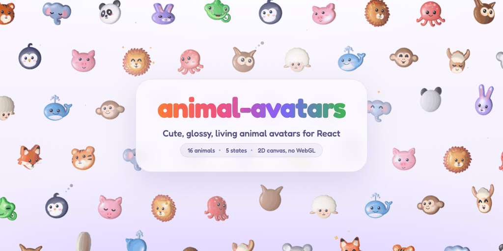

# animal-avatars

<picture>
  <source media="(prefers-color-scheme: dark)" srcset="docs/hero-dark.gif">
  <source media="(prefers-color-scheme: light)" srcset="docs/hero-light.gif">
  
</picture>

Animated animal avatars for React. Twelve glossy 3D animals, from a tiger to a whale, with living faces that blink, look toward the pointer, turn, hop and fall asleep. Drawn on a 2D canvas, no WebGL.

**[Try them live →](https://animal-avatars.fly.dev)** Play with every prop, see them in a chat and a team list, and read the API.

```bash
npm install animal-avatars
```

```tsx
import { AnimalAvatar } from 'animal-avatars';

<AnimalAvatar type="panda" size={64} />
<AnimalAvatar type="owl" state="thinking" />
<AnimalAvatar type="chameleon" state="working" />
<AnimalAvatar type="whale" state="happy" />
<AnimalAvatar type="bunny" state="sleeping" face="eyes" />
```

## The animals

| `type`      | Colour    | Look                                        | Mouth                       |
| ----------- | --------- | ------------------------------------------- | --------------------------- |
| `tiger`     | orange    | stripes, a cream muzzle, whisker dots       | "ω" under a pink nose       |
| `elephant`  | blue-grey | big pink-lined ears, a curling trunk        | none (the trunk sits there) |
| `panda`     | white     | black ears and eye patches                  | "ω" under a black nose      |
| `bunny`     | lilac     | tall ears, a pale muzzle                    | "ω" with buck teeth         |
| `chameleon` | green     | a casque, turret eyes, a curled tail        | a long smile                |
| `penguin`   | navy      | a heart-shaped white face, a crest curl     | an orange beak              |
| `pig`       | pink      | a snout with nostrils, pointed ears         | a small smile               |
| `lion`      | gold      | a big scalloped mane, a cream muzzle        | "ω" under a brown nose      |
| `octopus`   | coral     | spots, five curly tentacles                 | a small smile               |
| `owl`       | caramel   | feather tufts, rimmed facial discs          | a golden beak               |
| `sheep`     | cream     | a fluffy fleece, a peach face, tan ears     | "ω" under a pink nose       |
| `whale`     | sky blue  | a curling tail, a water spout, a pale belly | a long smile                |

Each head's front is a gentle dome. The eyes, the mouth and the markings (stripes, muzzles, patches, spots) all sit on it, so they turn together with the head. A beak is a feature rather than an expression, so it shows with either `face`, and it opens while working.

## States

- `default`: idle. Breathes, blinks, glances around and hops now and then.
- `working`: hops, and every third hop spins, with its mouth open.
- `thinking`: tilts its head and ponders from side to side, eyes up, with a small "hmm" of a mouth and a trail of thought bubbles pulsing above.
- `happy`: bounces and wiggles with its eyes squeezed into smiles and a wide grin, sparkles twinkling round its head.
- `sleeping`: eyes shut, head down, slow breaths.

A state change morphs the face rather than swapping it.

## Props

| Prop | Default | |
| --- | --- | --- |
| `type` | `'tiger'` | Which animal. |
| `state` | `'default'` | `default`, `working`, `thinking`, `happy` or `sleeping`. |
| `face` | the animal's own | `eyes`, or `mouth` for the eyes and the mouth. |
| `size` | `64` | Size in px, or any CSS length. |
| `color` | the animal's own | The head colour. `color="#F4F2FA"` on the tiger gives a white tiger. |
| `eyes` | the animal's own | Partial eye style: `size`, `tall`, `gap`, `y`, `color`, `shine`, `shineSize`. |
| `ink` | auto | The colour of the face. |
| `shading` | `'plastic'` | `plastic`, `crisp`, `smooth` or `flat`. |
| `interactive` | `true` | Follows a nearby pointer; a click makes it hop. |
| `speed` / `paused` | `1` / `false` | Animation speed, or freeze it. |
| `theme` | `'auto'` | The surface it sits on, for touches that must read against it. |

There are also lighting controls (`shadow`, `highlight`, `depth`, `light`, `rim`, `spread`), idle motion (`turn`, `seed`) and the jump (`jumpHeight`, `jumpEvery`, `jumpSpin` and friends). See `AnimalAvatarProps` in `src/types.ts` for all of them.

Motion respects `prefers-reduced-motion`, and the animation only runs while the avatar is on screen.

## Development

```bash
npm install
npm run dev        # the demo at http://localhost:5182
npm run typecheck
npm run build
npm run shapes     # regenerate src/shapes.ts from scripts/gen-shapes.mjs
```

The demo site lives in `site/` and is deployed to [animal-avatars.fly.dev](https://animal-avatars.fly.dev) on Fly.io. It serves the built files with nginx:

```bash
npm run build                  # the library first: the site takes its types from dist/
cd site && bun install && bun run build && fly deploy
```

The animated hero comes from `demo/hero-gif.html`, which draws every frame on a canvas. To re-record it, run `npm run dev` and `npm run hero` (a small server that collects the frames), then open `http://localhost:5182/hero-gif.html?theme=dark&sink=http://localhost:5199` and the same with `theme=light`. Each writes `docs/hero-<theme>.gif` with ffmpeg and gifsicle. Without `sink`, the page just plays the scene live.

`/review.html` shows every animal close up, at a few angles and in each state (`?a=owl,lion&size=220&light` narrows it down), which is handy when tuning shapes.

To add an animal:

1. Add its head outline, any parts drawn behind the head, and its markings to `scripts/gen-shapes.mjs`. Then run `npm run shapes`.
2. Add its name to `AnimalAvatarType` in `src/types.ts`.
3. Add its preset (colour, face position, dome, eyes, mouth) to `src/presets.ts`.

## Credits

The rendering engine comes from [bot-avatars](https://github.com/Jakubantalik/Libraries.dev/tree/main/packages/bot-avatars) by Jakub Antalik (MIT).

## License

MIT
